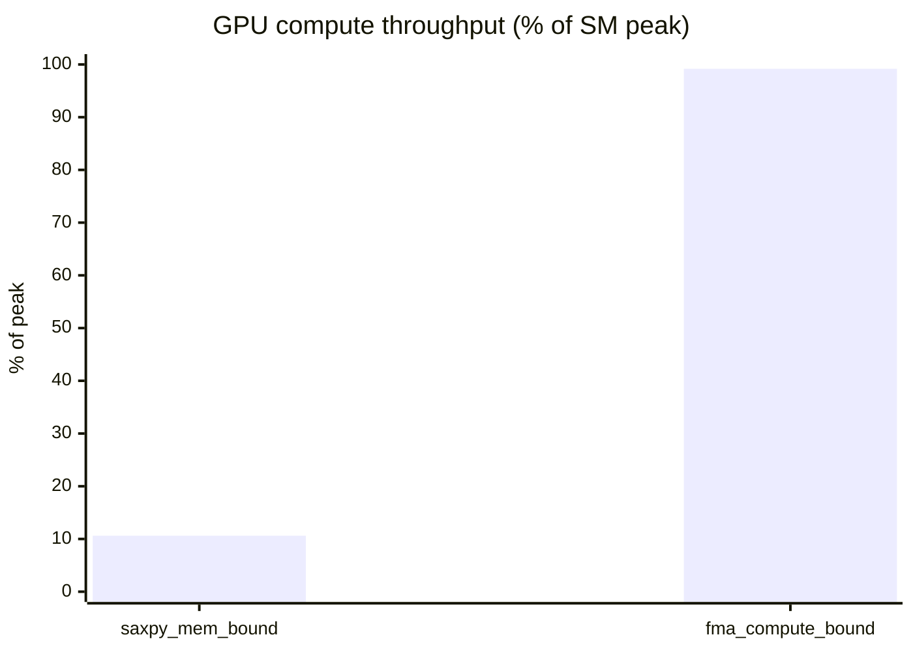
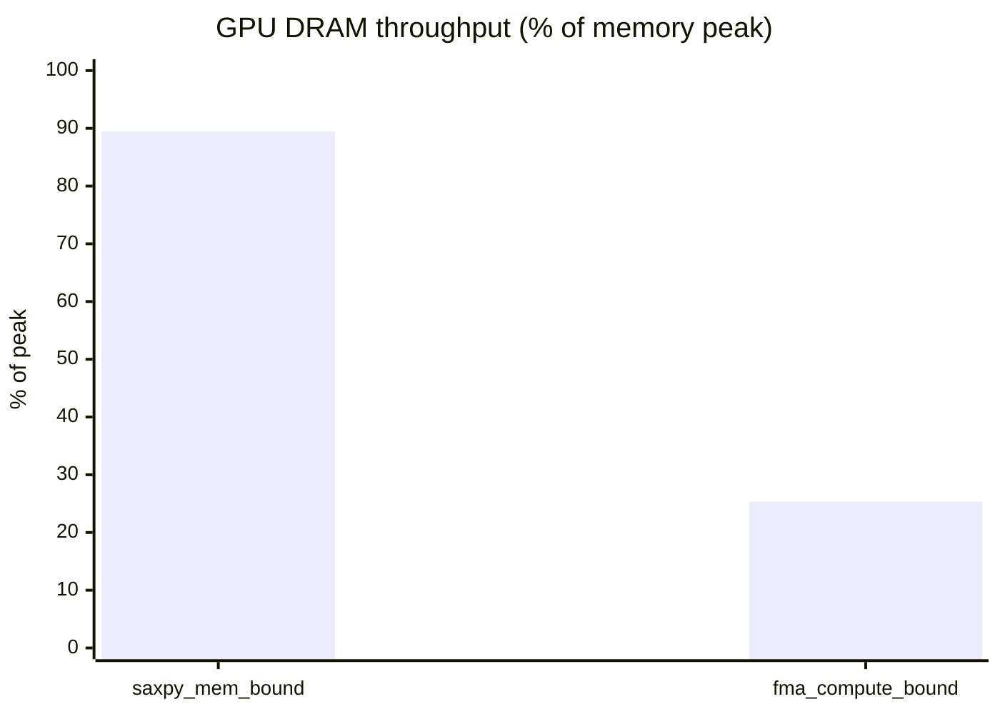
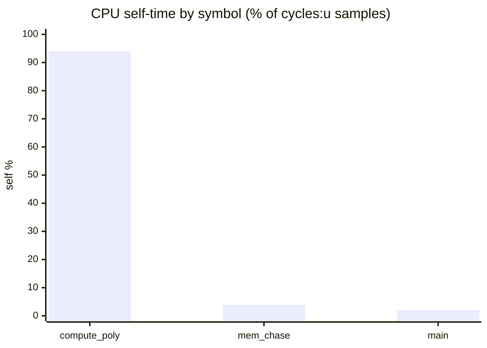

# perfdigest cross-backend benchmark — real captures, one neutral contract

Companion to [`RESULTS.md`](RESULTS.md) (which measures *token efficiency*). This
run measures the **other half of the thesis**: that perfdigest digests reports
from *different backends* into **one standard vocabulary**, with **honest
absence** (`None` ≠ `0.0`), on real hardware — and that an agent can read a GPU
kernel and a CPU function the same way.

Everything below was captured on this host and digested **through the perfdigest
MCP tools** (`list_kernels` / `get_metrics` / `expand`) — the raw reports never
entered the agent context.

## Host

| | |
|---|---|
| Machine | ASUS TUF Gaming A14 (FA401WV) |
| CPU | AMD Ryzen AI 9 HX 370 (Radeon 890M) |
| GPU | NVIDIA GeForce RTX 4060 Laptop (sm_89), driver 610.43.02 |
| Capture tools | `ncu` 2026.2, `nvcc` 13.3, `perf` 7.0.0 |
| MCP under test | `uvx perfdigest-mcp[nvidia]` (PyPI **v1.0.0**) |
| Date | 2026-06-15 |

`platform_capabilities()` correctly gated this host: **`nsight` + `linux_perf`
capturable here**; `rocm` (no `rocprof` on PATH) and `metal` (Linux, not Darwin)
**digest-only**. We captured exactly what the tool said we could.

## Method — one controlled experiment per backend

Each workload runs **two units with opposite roofline character and otherwise
identical setup**, so the digest contrast is the work, not the configuration.

- **GPU** (`bench/gpu_bench.cu`, `ncu --set full`): `saxpy_mem_bound`
  (2 loads + 1 store, 2 FLOP/elem) vs `fma_compute_bound` (long in-register FMA
  chain). Same block size (256), grid (131072), and 16 regs/thread.
- **CPU** (`bench/cpu_bench.c`, `perf`): `mem_bound_chase` (dependent pointer
  chase over a 128 MB buffer ≫ LLC) vs `compute_bound_poly` (dependent FMA chain
  in registers).

---

## 1 — GPU kernels (`nsight`, `format=ncu-rep`)

`get_metrics` default core set, verbatim from the MCP:

| metric (standard term) | `saxpy_mem_bound` | `fma_compute_bound` |
|---|--:|--:|
| `duration_us` | 1741.41 | 4272.42 |
| **`compute_pct_peak`** | **10.62** | **99.18** |
| **`dram_pct_peak`** | **89.44** | **25.34** |
| `mem_throughput_gbps` | 228.76 | 64.81 |
| `achieved_occupancy` | 87.57 | 95.79 |
| `l2_hit_rate` | 33.37 | 47.13 |
| `warp_cycles_per_issue` | 143.95 | 11.56 |
| `registers_per_thread` | 16 | 16 |

The crossover is textbook and the numbers cross-check: `saxpy` sits at
**89.4 % of DRAM peak ≈ 228.8 GB/s** (≈ the RTX 4060's ~256 GB/s GDDR6 ceiling)
and stalls **143.9 cycles/issue** waiting on memory; `fma` sits at **99.2 % of
compute peak** and barely stalls (11.6 cycles/issue). Same launch geometry —
only the work differs.

The two charts mirror each other — that mirror *is* the roofline diagnosis, and
the model reads it off seven numbers instead of an `ncu --page details` wall.

### `expand` cross-checks the digest

`expand(..., section="dram")` on `saxpy_mem_bound` returned **44 raw vendor
metrics**; the digest's `dram_pct_peak = 89.44` is exactly
`gpu__dram_throughput.avg.pct_of_peak_sustained_elapsed` from that raw set — the
digest compresses, it does not invent. (44 raw DRAM metrics for *one section* vs
14 numbers for the *whole* digest is the token-efficiency thesis in miniature;
[`RESULTS.md`](RESULTS.md) measures it end-to-end.)

---

## 2 — CPU functions (`linux_perf`)

Same agent, same `get_metrics` call shape — a **different vocabulary** (`ipc`,
`cache_miss_rate`, `self_pct`) because a CPU sampler measures different things.

### 2a. Hot symbols — `format=perf-report`

| function | `self_pct` | `samples` |
|---|--:|--:|
| `compute_bound_poly.constprop.0` | 93.99 | 22612 |
| `mem_bound_chase.constprop.0` | 3.92 | 940 |
| `main` | 2.05 | 586 |

A sampler has no per-symbol wall time, so `duration_us` is honestly `null` — not
a fabricated zero.

### 2b. Program counters — `format=perf-stat-json`

| metric | value |
|---|--:|
| `wall_time_ms` | 6960.59 |
| `instructions` | 15,608,069,442 |
| `cycles` | 30,477,977,620 |
| **`ipc`** | **0.512** |
| **`cache_miss_rate`** | **24.11 %** |
| `branch_mispredict_rate` | 0.0023 % |
| `llc_miss_rate` | `not_available_in_this_export` |

perfdigest is a **translator, not a judge**: it reports IPC 0.51 and a 24 %
cache-miss rate; *interpreting* that (dependent-chain latency + a buffer that
blows past LLC) is the model's job. `llc_miss_rate` is **honestly absent** —
`LLC-loads` / `LLC-load-misses` came back `<not supported>` on this AMD PMU, so
the digest returns `not_available_in_this_export`, **never `0.0`**. A fake zero
here would have told the model "no LLC misses" — the worst lie this tool can tell.

---

## Finding — `perf` scope-modifier normalization (fixed in this PR)

The benchmark surfaced a real gap in shipped **v1.0.0**. This host runs at
`perf_event_paranoid = 2`, so `perf` measures user-scope only and **renames every
event** with a `:u` modifier (`cycles:u`, `instructions:u`, …). The reader looked
up bare names (`ev("cycles")`), matched nothing, and returned the entire stat
digest as absent:

| `get_metrics(cpu_stat.json, perf-stat-json, "0")` | shipped v1.0.0 | after fix |
|---|---|---|
| `ipc` | `not_available_in_this_export` | **0.512** |
| `cache_miss_rate` | `not_available_in_this_export` | **24.11 %** |
| `instructions` | `not_available_in_this_export` | **15.6 B** |
| `llc_miss_rate` | `not_available_in_this_export` | `not_available_in_this_export` ✅ |

Fix (`adapters/linux_perf/perf_reader.py`): index each event under its bare name
too (strip a trailing `:[a-z]+` scope modifier), with the unmodified name still
winning. `llc_miss_rate` *stays* absent — the events truly were not counted —
proving the fix restores real counters **without** weakening the absence rule.
Locked by `tests/test_backends.py::test_cpu_perf_stat_strips_scope_modifiers`
against a new paranoid-host fixture. Full suite: **59 passed, 16 skipped**.

> A second, host-level gotcha (not a code bug): `perf stat -j` under a
> comma-decimal locale emits invalid JSON — capture with `LC_ALL=C`. Documented
> in `bench/README.md`.

---

## Bottom line

| backend | format | unit domain | captured here? | digest |
|---|---|---|---|---|
| `nsight` | `ncu-rep` | `gpu_kernel` | ✅ | 2 kernels, clean roofline split |
| `linux_perf` | `perf-report` | `cpu_function` | ✅ | 3 hot symbols by self % |
| `linux_perf` | `perf-stat-json` | `cpu_function` | ✅ | IPC / cache, fixed `:u` handling |

One agent, one call shape (`list_kernels` → `get_metrics` → `expand`), three real
reports across two backends and two vocabularies — GPU roofline and CPU IPC read
the same way, with absences kept honest. That is the multi-backend contract
working on real hardware.

*Reproduce: see [`bench/README.md`](bench/README.md).*
